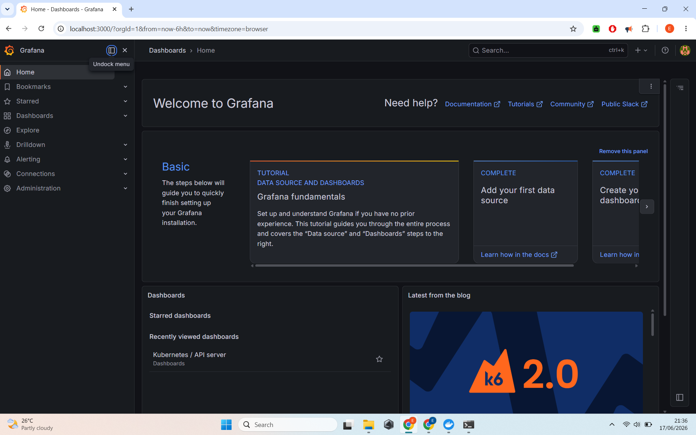
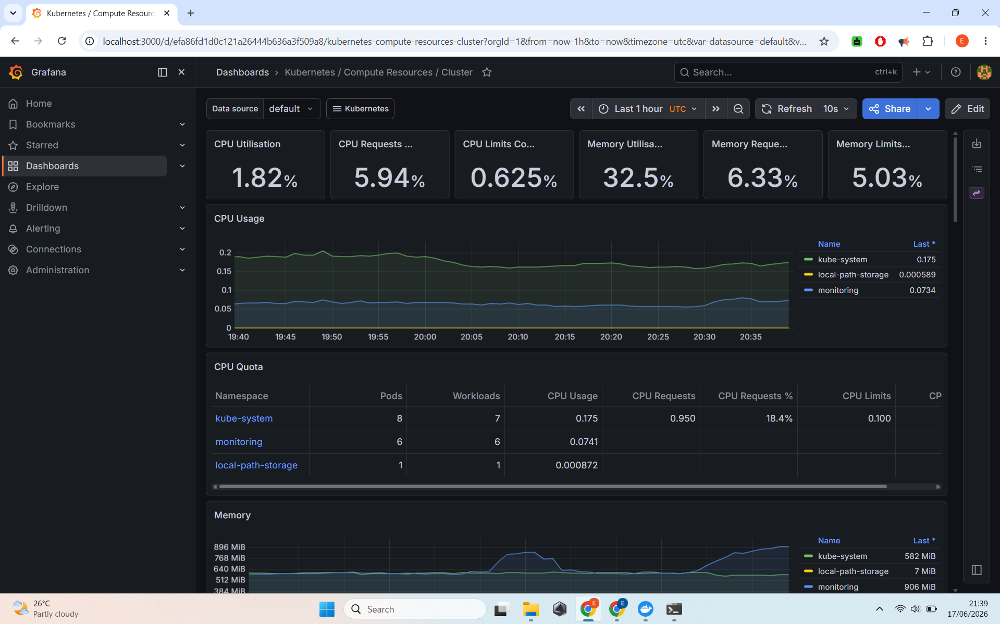
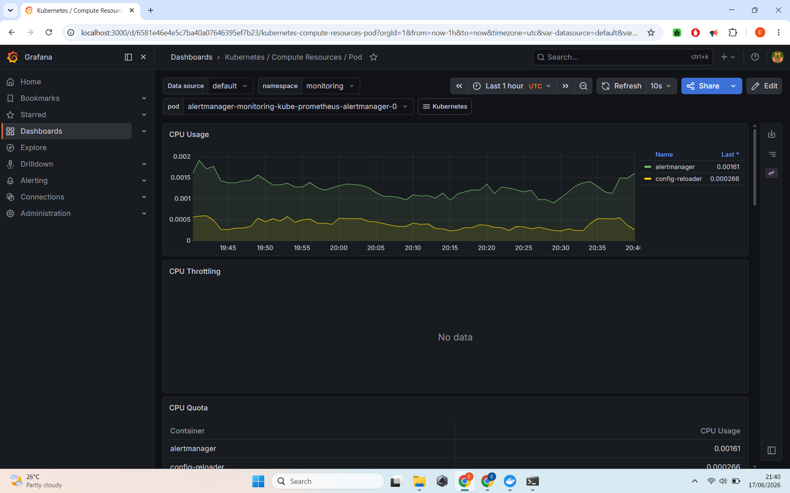
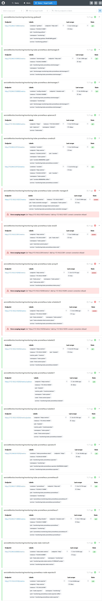
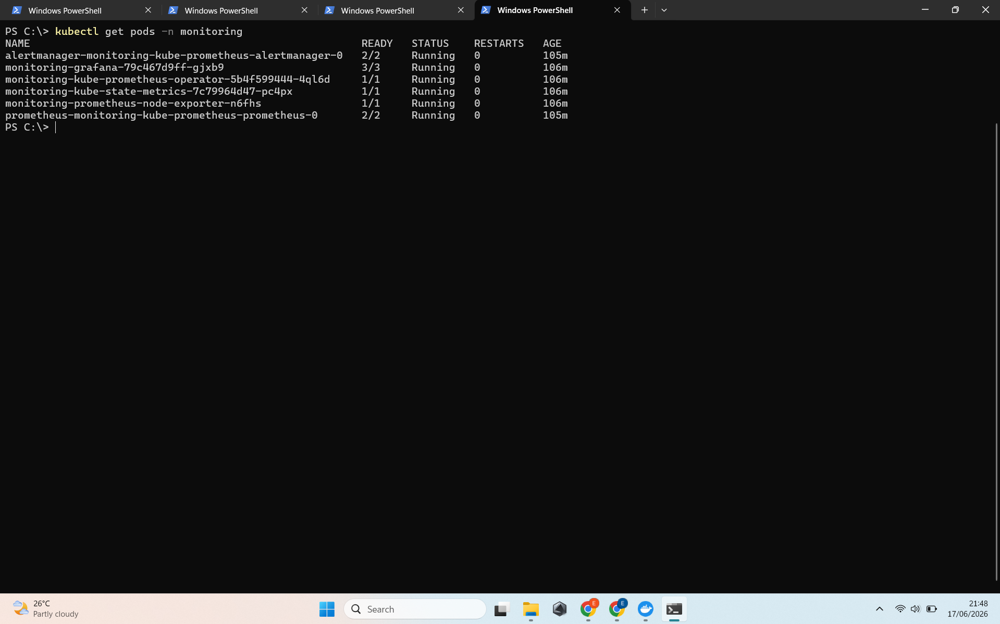
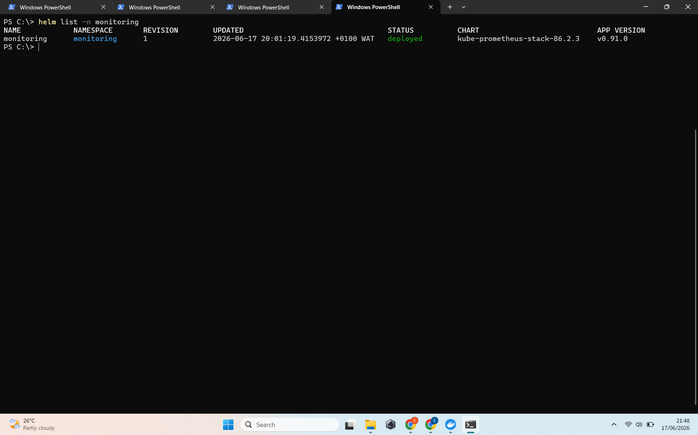

# Monitoring & Observability Stack with Prometheus + Grafana

**Production-grade monitoring setup for Kubernetes using Prometheus and Grafana**


---

## 📋 Project Summary

Deployed a complete **Monitoring and Observability** solution on a local Kubernetes cluster (Kind) using the Prometheus stack. This project demonstrates how to collect metrics, visualize them in beautiful dashboards, and set up observability.

**Status**: Fully Functional

---

## 🎯 Objectives & Achievements

- Installed and configured Prometheus + Grafana using Helm
- Monitored a Kubernetes cluster in real-time
- Explored pre-built dashboards for Nodes, Pods, Deployments, etc.
- Understood core observability concepts (Metrics, Dashboards, Alerting)

---

## 🛠️ Technologies Used

| Category              | Technology                              |
|-----------------------|-----------------------------------------|
| Monitoring            | Prometheus                              |
| Visualization         | Grafana                                 |
| Orchestration         | Kubernetes (Kind)                       |
| Package Manager       | Helm                                    |

---

## 📸 Project Screenshots

### 1. Grafana Home Page


### 2. Kubernetes Cluster Overview Dashboard


### 3. Pod & Container Metrics


### 4. Prometheus Targets


### 5. Monitoring Pods Status


### 6. Helm Installation


---

## 🧩 Architecture

- **Prometheus** scrapes metrics from Kubernetes components
- **Grafana** visualizes the data with rich dashboards
- **Alertmanager** handles alerts (included in the stack)
- All running inside a local Kind Kubernetes cluster

---

## 💡 Skills Demonstrated

- Deploying complex monitoring stacks with Helm
- Understanding Prometheus metrics and scraping
- Creating and interpreting observability dashboards
- Kubernetes resource monitoring
- Production-ready observability practices

---

## 🚀 How to Reproduce

```bash
kubectl create namespace monitoring
helm repo add prometheus-community https://prometheus-community.github.io/helm-charts
helm repo update
helm install monitoring prometheus-community/kube-prometheus-stack --namespace monitoring
